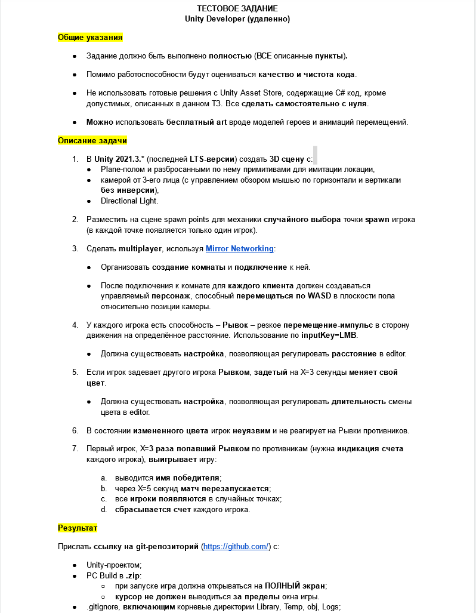

# Тестовое задание HB

## Исходный текст задания:

## Пояснения к выполнению.

Библиотека для меня новая, по этому деталей ее работы я не знаю, а следовательно планировать время и решение я могу. Поскольку, задача в большей степени основывается на функциональности библиотеки, то и качество решения в большей степени отражает зрелость и удобство использования библиотеки, а так же полноту и достоверность документации. Не смотря на то, что версия библиотеки довольно высокая, в ней все же отсутствуют инструменты для решения типовых задач или описания для их решения. Например часть задания, связанную, с рестартом матча, я реализовал в обход библиотеки (нет очевидного решения или инструкции по реализации), хотя это типовая задача для подобного рода приложений. Из выше сказанного, а так же в связи с материальными ограничениями во времени и финансировании (выполнение задания не оплачивается) предполагаю, что задание выполнено на достаточном в смысле качества уровне: оно реализовано в минимальной но вместе с тем достаточной степени для удовлетворения пунктов требований и предполагает настройку кодом и данными, достаточную для конфигурирования и экспериментов.

## Пояснения по тексту задания

1. (выполнено с обоснованием) проект в версии 2021.3.11f1
  - плоскость и кубы в качестве примитивов в сцене матча. физика столкновений с кубами выключена, разработка детерминированной физики столкновений с препятствиями для синхронизации возможна, однако сравнительно затратна в рамках тестового задания
  - условие не точно: принимаю как вертикальный поворот камеры, горизонтальный поворот персонажа. результат: в рамках игры отражена все необходимая информация, требующаяся от камеры, инверсия отсутствует т.к. направление движения мыши соответствует направлению смещения фокуса пользователя
  - рамках плагина и задачи сложно говорить об источнике света, но в сцене матча от присутствует

2. (выполнено с обоснованием) размещено 4 точки, максимальное число подключений 4. в тексте задачи не оговорено максимальное количество игроков, однако по очевидным причинам - количество конечно. настройка RoundRobin выбрана для предотвращения пересечения игроков в первом матче, в последующих точки старта назначаются случайно. возможно предполагалось назначение настройки Random, однако в виду требования задачи, недостатков реализации плагина и принятием того факта, что порядок подключения игроков не определен, а следовательно случаен - требование можно считать удовлетворенным. возможно лучшее понимание плагина или его модификация дадут возможность реализации требования механизмами плагина. пользуясь условием на которых взялся за задачу - трактую пункт в свою пользу.

3. (выполнено с обоснованием) по тексту пункта, точно не ясно что такое комната. из текста можно заключить, что сцена в которой происходит сборка игроков и сцена матча - это одна и та же сцена. для меня было бы легче так это и принимать, однако термин 'комната' используется в плагине, следовательно присутствует в реализации как механика.
  - создание реализовано
  - после подключения к комнате, после перехода далее в сцену матча, персонажи имеют возможность перемещаться в соответствии с требованием - формально выполнено, однако пункт неточен и может трактоваться по разному. другие его трактовки выполняются проще. пользуясь условием на которых взялся за задачу - трактую пункт в свою пользу.

4. (выполнено с обоснованием) рывок реализован, настройка есть в префабе персонажа. используется прямое чтение кнопок, в связи с неточностью управления движка. необходимы затраты на реализацию механизма ввода - за рамками задания.

5. (выполнено с обоснованием) атакованный меняет цвет в случае поражения атакой. настройка длительности повреждения есть в префабе персонажа.

6. (выполнено) интервал поражения не изменяется с повторной атакой

7. (выполнено) индикация реализована, имя выводится, перезапуск матча через 5 секунд происходит, все игроки появляются в случайных точках (используются точки старта, трактовка в мою пользу), счетчик поражений сбрасывается для всех участников на всех клиентах

Передача:

- проект в репозитории
- архив приложения в репозитории и [по ссылке](./_build.zip)
  - открывается на полный экран
  - курсор скрыт
- в игнор файле из репозитория исключены временные и сгенерированные файлы и папки (трактовка в мою пользу)
- Dmitriy Evteev

## Прочие замечания

Так же замечу, что, на мой взгляд, библиотека пытается решать задачи, излишние в рамках предназначения. Делает она это плохо, по этому в целом пользоваться не удобно. В дальнейшем ее развитии в том или ином виде, предположу, что лучшим вариантом будет убрать всю реализацию, касающуюся управления сценами и ассетами, формализовать решение связанной с реализацией и тестированием разработки коммуникации и реализовать, заявленную в документации реализацию сервера как отдельного структурного элемента. Так же не понимаю причин, по которым понадобилось переписывать kcp, однако то, что библиотека имеет открытый исходный код, является очень большим плюсом.
